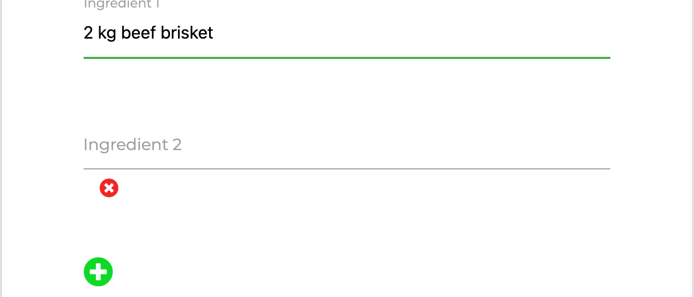

# Zesty Recipes

Zesty is a website for the spice loving community where users will be able to view all kind of chilli-infused 
recipes added by users as well as creating an account and showing off their own.

[>> View the live site here <<](http://zesty-recipes-project-ms3.herokuapp.com/)


## UX

Zesty has a minimal, clean design with the main focus being on the recipes and adding new ones.  
Users will be able to view current recipes displayed on the website but if they wish to add their own they are required to create an account.

The Design of the website is mainly off white with a bold, vibrant red to emphasize all the main focal points throughout the website.

### User's goal

* Create an account.
* Create, Update and Delete Recipes.
* Search for specific recipes.
* Visually Pleasing.
* Spice level displayed in each recipe.
* Recipe servings displayed.

### Site owner's goal

* Easy to sign up for the website.
* Add Recipes with no problems.
* Navigate through the site easily.

### Development goals

* Minimal Design with the recipes being the main focus.
* Responsive on all devices.
* Insuring C.R.U.D is implemented.
* Effective search bar.

### User's Stories

* A vibrant red button is diplsayed within the navbar to intise users to create an account.
* All users logged in can create, update and delete their recipe.
* A Search bar is displayed within the Recipe page so users can search for a specific recipe.
* The website is clean and minimal with the main focus being on the recipes.
* A Spice level is displayed within the full recipe page.
* Recipe Servings are also displayed on the full recipe page.

**As a User on the website I want:** 

* To be able to view all recipes added by users.
* Easily add and edit my recipes.
* Delete my recipe if I dont wish to display it anymore.
* Search for a specific recipe.
* View my profile.
* Log Out when im not using the website.

**As the Site Owner on the website I want:** 

* An admin account where I can edit and delete all recipe added.
* Edit the add recipe options if I need to do so.
* View all users in the data base.

**As a Developer Developing the website I want:** 

* The design to be clean and minimal.
* Deployed to heroku.
* All users and recipe stored via MonogDB
* Fully responsive on all devices

### WireFrames

* [Zesty - Home](static/images/wireframes/zesty-home-page.png)
* [Zesty - Sign Up](static/images/wireframes/zesty-sign-up-page.png)
* [Zesty - Recipes](static/images/wireframes/zesty-recipe-page.png)
* [Zesty - Add Recipes](static/images/wireframes/zesty-recipe-add-page.png)
* [Zesty - Full Recipe](static/images/wireframes/zesty-recipe-full-page.png)
* [Zesty - Log In](static/images/wireframes/zesty-login-page.png)
* [Zesty - Profile](static/images/wireframes/zesty-profile-page.png)

###  Design Choices

**Fonts** 

* All Header will be using the font Prompt size 600
* All paragraphs and button text will be using Monsterrat size 400

**Colour** 

* To implement the clean minmal design the background and menu will be white - #fafafa
* All Headers will be #000000
* Paragraph text will be a light grey - #7F7F7F
* All buttons and focus point text will be a vibrant red from the logo - #FC2929

You can view the final homepage mockup design below:

[Zesty Home Page Mockup](static/images/wireframes/Desktop-Home-Zesty-recipes-mockup.png)

## Features

### Existing Features

* Feature1 - A Sign-Up form where users can create an account.
* Feature2 - A Login page for users who have already created an account.
* Feature3 - A recipe page full of paginated recipe cards.
* Feature4 - All recipes when clicked will have a full page with more info on it.
* Feature5 - Logged in Users will be able to add their recipes and view their profile page.
* Feature 6 - A recipe created by the user can be edited and deleted.
* Feature 7 - Search for a specific recipe in the search bar.
* Feature 8 - Logout with ease.
* Feature 9 - The navbar changes dpending on if your are logged in or out.
* Feature 10 - All data is stored within MongoDB.

### Features Left to Implement

* I would like to apply email verification before users can add recipes.
* I would like an add to favourites section.
* I would like the admin to approve recipes before it goes live on the site.

## Technologies Used

* [HTML](https://en.wikipedia.org/wiki/HTML)
    * For Structuring the site.

* [CSS](https://en.wikipedia.org/wiki/CSS)
    * For Styling the Site.

* [Python](https://www.python.org/)
    * For programming the site.

* [Materialize](https://materializecss.com/)
    * For Grid Layout & Components.

* [Google Font](https://fonts.google.com/)
    * For selected font.

* [JQuery](https://jquery.com/)
    * Used for certain sections within the script.js file

* [Flask](https://flask.palletsprojects.com/en/2.0.x/)
    * Rendering Templates.

* [Github](https://github.com/)
    * Storing project on.

* [Heroku](https://id.heroku.com/login)
    * Deploying the website.

* [Font Awesome](https://fontawesome.com/)
    * Deploying the website.

* [MongoDB](https://www.mongodb.com/)
    * Storing Data.

* [Gitpod](https://www.gitpod.io/)
    * For Developing the Website.

* [Balsamiq](https://balsamiq.com/wireframes/?gclid=Cj0KCQiA3smABhCjARIsAKtrg6JfbE3I-05NWUBL17jlkE6uDkROXDoD5vXo7UJxVKIjsLVwujyaus0aAhAiEALw_wcB)
    * Creating wireframes on.

* [Google Chrome Developer Tool](https://developers.google.com/web/tools/chrome-devtools)
    * Checking the website is responsive on multiple different devices.

* [Affinity Designer](https://affinity.serif.com/en-gb/designer/)
    * Creating Zesty Logo.

* [Affinity Designer](https://affinity.serif.com/en-gb/designer/)
    * Editing Banner.

## Testing

* Devices tested on:
    * Macbook Pro 13"
    * Lg 27" Monitor
    * iPhone 11
    * All devices in inspector tool.

* Browsers Tested on:
    * Google Chrome
    * Safari
    * Firefox

### User's Stories

* All users logged in can create, update and delete their recipe.
* A Search bar is displayed within the Recipe page so users can search for a specific recipe.
* The website is clean and minimal with the main focus being on the recipes.
* A Spice level is displayed within the full recipe page.
* Recipe Servings are also displayed on the full recipe page.

### Manual Testing

1. Sign Up Form
    * When Clicked on the signup button you are directed to the signup Page.
    * When details are typed in correctly you are validated with a green underline.

    

    * If your details dont match the requirements the validation will be in red.
    * When I click submit with incorrect requirements I will not be able to proceed.

    

    * When all details are correct and I click Sign Up I am sent to my profile page.

    

2. Login Form
    * When I click login I am directed to the login page.
    * If I click login whilst form is blank I am promted to fill the fields.

    

    * If username or password is incorrect you are prompted with a message.

    

    * If all is correct you are directed to my profile page.

3. Recipe page
    * When recipe is clicked you are directed to the recipe page.
    * All cards are diplayed in columns of 3,2,1 depending on device.
    * At the bottom of the page after 9 recipe cards the page is paginated with next and previous.

    

4. Full Recipe
    * When you hover over a recipe cards text a hover effect will happen so you are aware its clickable.
    * When text or image is Clicked you will be directed to the full recipe.
    * Text is displaed at the top to direct you back to all recipes.

    

5. Add a Recipe
    * When logged in the add recipe option will apear in the navbar.
    * Click the add recipe text and you are directed to the page.
    * When adding a new recipe all fields require validation.

    

    * To add multiple ingredients/instructions clicking on the add green button will add a new line.

    
    

    * Paste you image address.
    * Once you click add recipe you are directed to the recipe page where your recipe will be displayed.

    
    

6. Edit and Delete Recipe
    * Only the Recipe you created can you edit and delete.
    * Recipes you created will display your username along with an edit and delete button.

    

    * Click the edit button will direct you to edit recipe page.
    * All details you previously entered will be displayed.

    

    * Any changes made and saved will updated into the recipe.
    * If you click the delete button you will be prompted with an are you sure message.

    

    * Once you confirm your recipe will be removed completely.

7. Search for Recipe
    * Search for a specific dish through a key word .eg - "Chicken"

    

    * Clicking reset will revert back to the full recipe page.
    * If there is no results for what you search for then no results will appear.

    

8. Logout with ease
    * When you wish to logout just click the large logout button in red.
    * You will be directed back to the login page.

    

9. Navbar
    * The navar is displayed on both desktop and tablet
    * A burger menu is displayed within mobile.

    

    * Users logged out will see this menu.

    

    * Users logged in will see this menu.

    

10. MongoDB
    * All data is stored on MongoDB under the collection of recipe_manager.

    

11. Admin
    * The admin user has the ability to edit and delete all users recipes.

    

### Testing Code

* W3C Markup Validator
    * [Home](https://validator.w3.org/nu/?doc=http%3A%2F%2Fzesty-recipes-project-ms3.herokuapp.com%2F)
    * [Recipes](https://validator.w3.org/nu/?doc=http%3A%2F%2Fzesty-recipes-project-ms3.herokuapp.com%2Fview_recipes)
    * [Login](https://validator.w3.org/nu/?doc=http%3A%2F%2Fzesty-recipes-project-ms3.herokuapp.com%2Flogin)
    * [Signup](https://validator.w3.org/nu/?doc=http%3A%2F%2Fzesty-recipes-project-ms3.herokuapp.com%2Fsignup)
    All Other pages where unable to be validated

* W3C CSS Validator


* PEP8 Online Validator


* Sites Performance

**Home**
 | 
Desktop | Mobile

**Recipes**
 | 
Desktop | Mobile

**Login**
 | 
Desktop | Mobile

**Sign Up**
 | 
Desktop | Mobile

### Bugs Discovered

* Problem 1 - Using this logo href would not show on any page that was retrieving data from MongoDB.

```
<a href="{{ url_for('index') }}" class="logo"></a>
```

* Problem 1 SOLVED - By add a forward slash at the start of the img src worked perfectly.

```
<a href="{{ url_for('index') }}" class="logo"></a>
```

* Problem 2 - One I added pagination to the recipe page, any time I searched for a recipe the page would crash.

```
def get_recipes(offset=0, per_page=9):
    recipes = list(mongo.db.recipes.find())
    return recipes[offset: offset + per_page]


# All Recipes
@app.route("/view_recipes")
def view_recipes():
    recipes = list(mongo.db.recipes.find().sort("recipe_name", 1))

    # Pagination
    page = int(request.args.get('page', 1))
    per_page = 9
    offset = (page - 1) * per_page

    total = len(recipes)
    pagination_recipes = get_recipes(offset=offset, per_page=per_page)
    pagination = Pagination(page=page, per_page=per_page, total=total,)

    return render_template(
        "recipes.html", recipes=pagination_recipes,
        page=page, per_page=per_page, pagination=pagination)
```

* Problem 2 SOLVED - In order to fix that I routed the search results to a sepreate template.

```
# Search Recipes
@app.route("/search_recipe", methods=["GET", "POST"])
def search_recipe():
    search = request.form.get("search")
    recipes = list(mongo.db.recipes.find({"$text": {"$search": search}}))
    return render_template("search.html", recipes=recipes)
```

* Problem 3 - I was uploading local images into MongoDB so my recipe images wasnt showing
* Problem 3 SOLVED - I changed the recipe image field to a text input so you can paste in your image address

## Deployment


## Credits


### Content

* https://stackoverflow.com/questions/26025057/add-custom-text-to-ordered-list-li

* https://www.codegrepper.com/code-examples/css/delete+confirmation+message+on+click

* https://www.youtube.com/watch?v=Lnt6JqtzM7I&ab_channel=PrettyPrinted

* https://gist.github.com/mozillazg/69fb40067ae6d80386e10e105e6803c9

### Media

* https://www.pexels.com/photo/food-plate-healthy-nature-7215171/


### Acknowledgements

